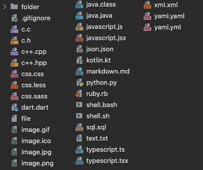

# JetBrains Icon Theme for VSCode

This icon theme uses official JetBrains icons from [https://jetbrains.design/intellij/resources/icons_list/](https://jetbrains.design/intellij/resources/icons_list/).

