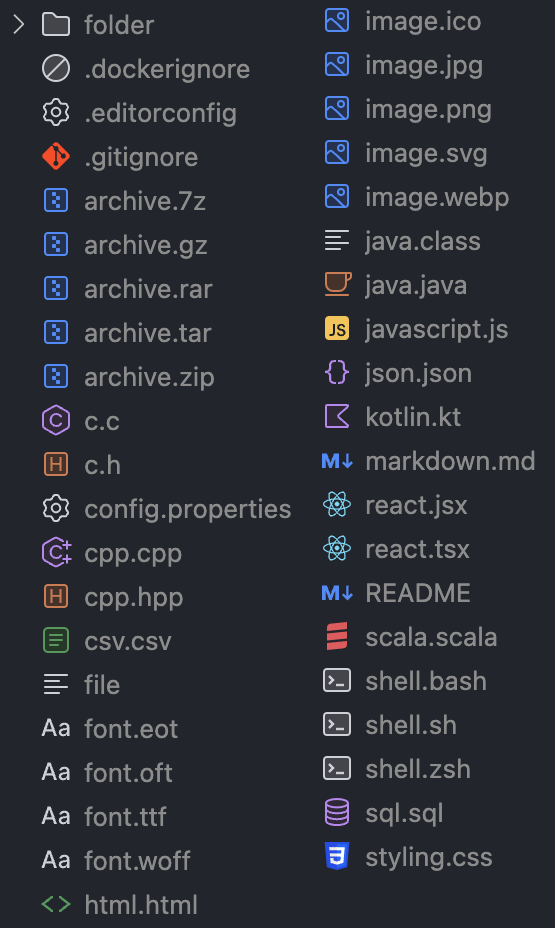
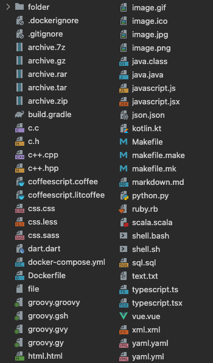

# JetBrains Icon Theme for VSCode

**JetBrains Icon Theme for VSCode** is an extension for [Visual Studio Code](https://code.visualstudio.com/) that brings a sleek set of icons inspired by JetBrains IntelliJ products.

Most icons are sourced from [JetBrains Design Resources](https://intellij-icons.jetbrains.design/).

---

## Table of Contents

- [Description](#description)
- [Installation](#installation)
- [Themes](#themes)
  - [UI 2023+](#ui-2023)
  - [Version V1](#version-v1)
- [Links](#links)
- [Contributing and Support](#contributing-and-support)

## Description

This extension provides a stylish icon set to make your VSCode experience modern and professional. Inspired by the design of JetBrains products, this theme focuses on quality and aesthetics.

## Installation

Install the extension directly from the [Visual Studio Marketplace](https://marketplace.visualstudio.com/items?itemName=chadalen.vscode-jetbrains-icon-theme)

## Themes

### UI 2023+

*Supports Light, Dark, and Auto variants*  
**Preview:**

### Version V1

**Preview:**

## Links

[Visual Studio Marketplace](https://marketplace.visualstudio.com/items?itemName=chadalen.vscode-jetbrains-icon-theme)

[Contributing](./docs/CONTRIBUTING.md)

## Contributing and Support

If you have suggestions, bug reports, or ideas for improvements, please open an [issue](https://github.com/chadalen/vscode-jetbrains-icon-theme/issues) on GitHub. Your contributions are highly appreciated!

If you enjoy the project, consider supporting it on [Buy Me A Coffee](https://www.buymeacoffee.com/cadamsdev).
